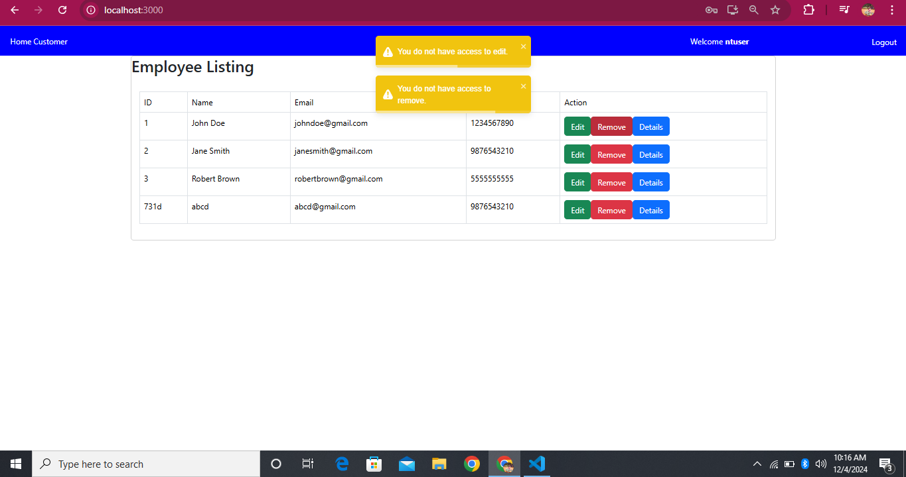

# Role Based Access Control(RBAC) UI
Building an admin dashboard for managing users, roles, and permissions.
## Installation and Setup

1. **Clone the repository:**
   ```
    git clone https://github.com/your-username/react-rbac.git
    cd react-rbac
   ```
2. **Install Dependencies:**
   ```
    npm install bootstrap
    npm i react-toastify
   ```
3. **Implement Routing:**
   ```
    npm install react-router-dom
   ```
4. **Define & Run JSON Server REST API:**
   ```
     json-server --watch db.json --port 8000
   ```
5. **Start the Development Server:**
   ```
   npm start
   ```
6. **Open the application in your browser:**
   ```
    http://localhost:3000
   ```
## Explanation
There are 2 roles
  1.admin
  2.user
### For Admin Login (Credentials)
Username: adminuser
Password: admin
Admin can add, edit, remove and view employee details
### For User Login(Credentials)
Username: ntuser
Password: ntuser
User can only view employee details only no other actions can be performed.

## Screenshots
### Login Page


### New User Registration Page


### Admin View Page


### Admin Edit Page


### Admin Remove Page


### User View Page


### User Edit Remove 


### User View Details Page

   
